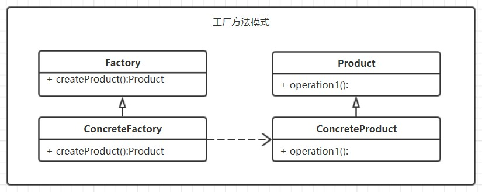
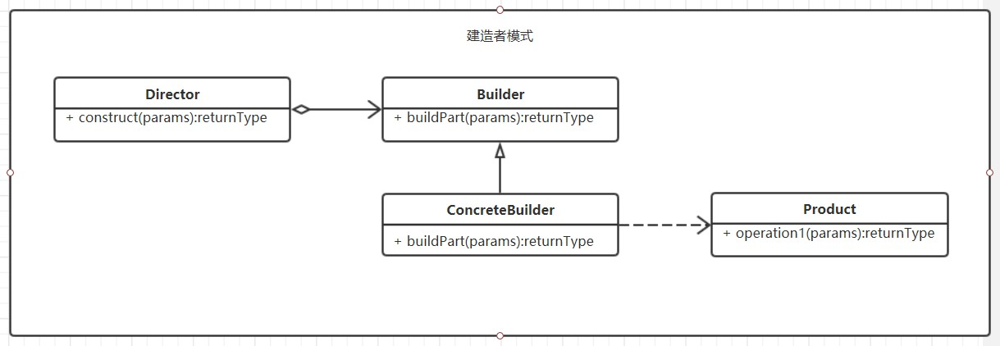
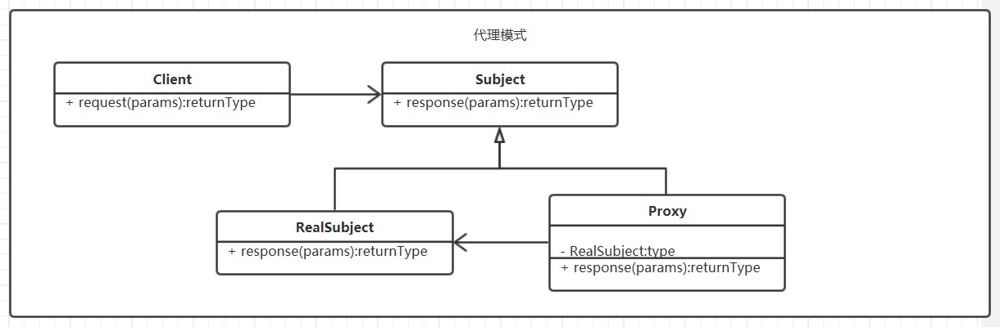
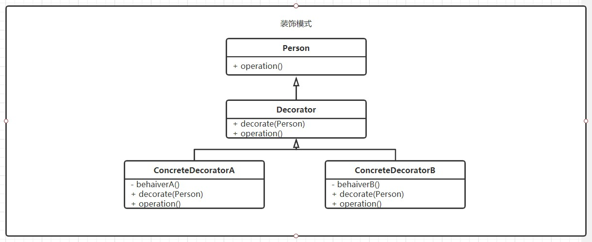
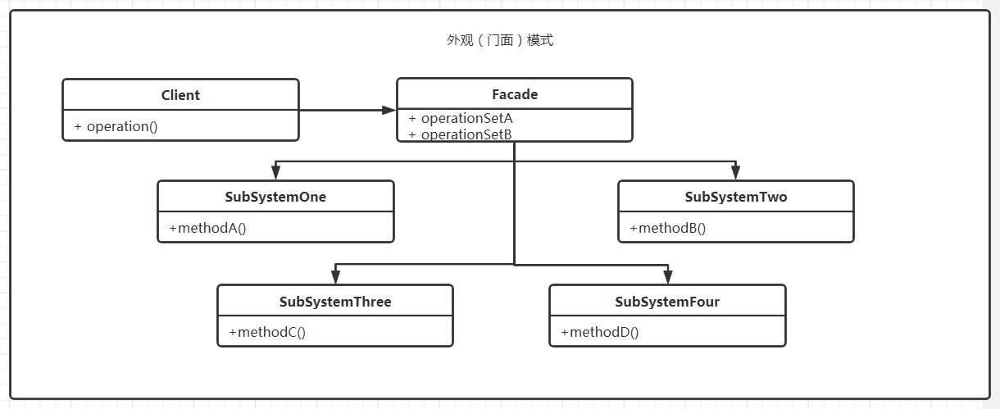
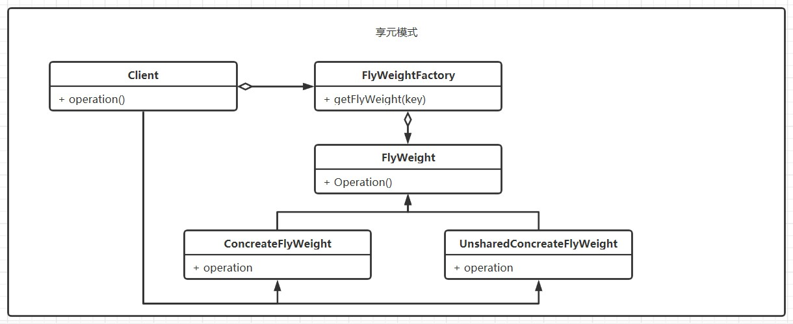

#设计模式笔记

设计模式分为三类，**创建型**，**结构型**，**行为设计**。这里我将抽取其中自己认为常用且比较重要的进行代码实践。

1. 创建型
    - 工厂方法模式。#
    - 建造者模式。#
2. 结构型
    - 代理模式。#
    - 装饰模式。#
    - 外观模式。#
    - 享元模式。#
3. 行为设计
    - 策略模式

# 创建型

## 1.工厂方法模式

### 定义
一个用于创建对象的接口，让子类决定实例化对象。

### UML类图

## 2.建造者模式

### 定义
将一个复杂对象的构建与它的表示分离。

### UML类图

# 结构型

## 1.代理模式

### 定义
为其他对象提供一种代理，以控制对这个对象的访问。

### UML类图

## 2.装饰模式

### 定义
为已有功能的对象动态添加更多功能。而若新加入的东西仅仅是满足特殊行为的需要，建议使用装饰模式避免对原有类增加复杂度。

### UML类图

## 3.外观模式

### 定义
为子系统中的一组接口提供一个一致的界面（对外发言人），由发言人来对外洽谈合作。故又称门面模式。

## UML类图

## 4.享元模式

### 定义
运用共享技术有效的支持大量细粒度（大部分参数形同）的对象。多用于大量相似对象，需要缓冲池场景。

 ## UML类图
 